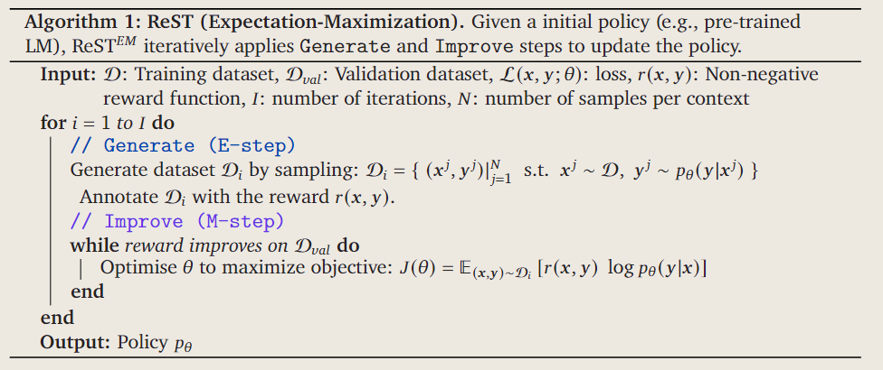
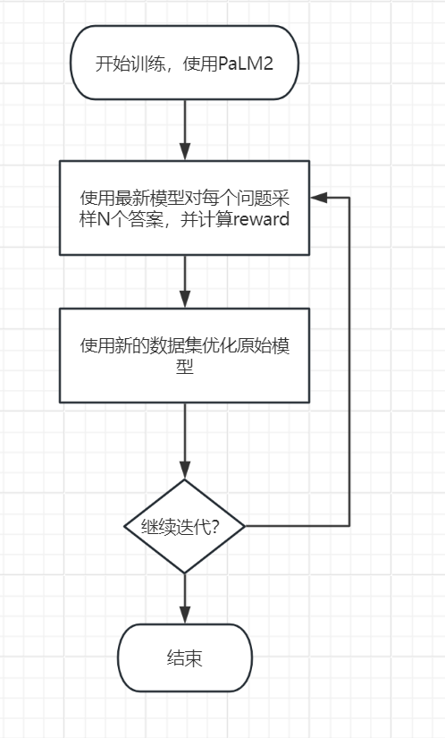
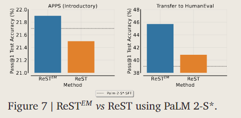
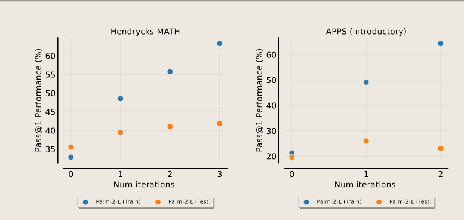

# $ReST^{EM}$
探索使用非人类标注的数据    
提出一种基于期望最大化(Expectation-Maximization)的自训练方法，称为$ReST^{EM}$。

## 强化自训练的期望最大化
生成(E步骤)：语言模型为每个输入上下文生成多个输出样本。然后，使用二值奖励（值为0和1）过滤这些样本以收集训练数据集。

改进(M步骤):使用来自上一生成步骤的训练数据集对原始语言模型进行监督微调。具体为最小化奖励加权负对数似然损失：$J(\theta)=\mathbb{E}_{(x,y)\sim D} [r(x,y) \log P_\theta(y|x)]$。然后在下一个生成步骤中使用微调后的模型。

## 训练细节
reward只使用数据集提供的答案的对错

对于每个问题生成固定数量的回答，MATH数据集是32，APPS是64。对于每个solution，使用top-k采样模型生成数据，实验中k设为40，temperature设为0.7。

然而，直接使用所有这些模型生成的解决方案可能会导致不平衡的数据集，因为我们将对更容易的问题有更多的正确解决方案。为了缓解这种情况，我们为每个问题引入了最大解数的截止阈值(cut-off threshold)，包含在微调数据集中：MATH和APPS中均为 10。**这种方法确保训练数据的多样性并防止过度拟合更容易的问题**。

## 想法
1. 论文使用二元奖励函数（值为0和1），将错误答案剔除，能否换成-1和1视作将错误答案看成反例或者将值改为连续值
2. 文章有提出微调初始模型或上一个模型的问题，并做实验证明微调初始模型更高分
    
3. 文章有提出使用蒙特卡洛树搜索生成样例的改进想法
4. 过少的数据会导致过拟合，APPS数据集有2342个训练问题，总数据集大概10k

*tips：pass@k 衡量一个问题的 k 个生成解决方案中至少有一个是正确的概率*
5. reward函数需要重新构建