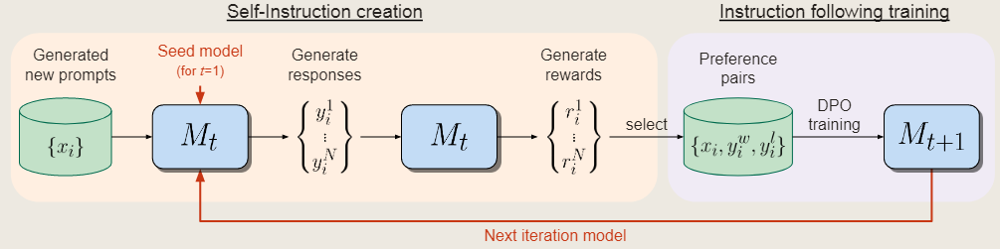

# Self-Rewarding Language Models
## 自奖励语言模型
需要准备一个预训练语言模型（论文使用Llama2 70B），以及一些人类标注的数据集，训练一个模型，有两个作用：
1. 指令跟随：根据指令生成文本
2. 自指令生成：生成和评估新的指令跟随样例，并加入到自己的数据集。包括生成候选回答并由模型自评估，经过LLM-as-a-Judge的方法（用专门的提示词）

### 初始化
1. 初始化指令跟随数据   
    由**人类标记**的，结构为(指令提示词，响应)，用以SFT，后面用Instruction Fine-Tuning (IFT) data 指代
2. 初始化LLM-as-a-Judge指令跟随数据     
    结构为(评估指令提示词（要求模型以特殊指令评估给定响应的质量），评估结果响应（包含推理思维链，以及最终分数（0~5分））)，有5个方面（相关性、覆盖范围、有用性、清晰度和专业知识），后面用Evaluation Fine-Tuning (EFT) data 指代

### 自我指令生成
1. 使用小样本提示词生成一个新的提示词，使用原始IFT数据
2. 对每个提示词$x_i$生成N个候选响应$\{y_i^1, y_i^2, \dots ,y_i^N\}$
3. 使用LLM-as-a-Judge模型对每个候选响应进行评估，分数为$r_i^n \in [0,5]$

### 指令跟随训练  
在生成指令之后可以用这些数据扩充原始数据集，称为AI Feedback Training (AIFT) data，数据集由preference pairs组成，结构为(指令提示词$x_i$，获胜响应$y_i^\omega$，失败响应$y_i^l$)，获胜响应$y_i^\omega$和失败响应$y_i^l$分别取N个评估候选响应的最高分和最低分，若相同则丢弃该数据。

我们使用DPO

即 IFT是用来SFT的数据集，EFT是一开始微调训练模型reward的数据集，AIFT是模型用来做DPO训练的数据集
### 总体自对齐算法
训练一系列模型$M_1, \dots, M_T$，第$t$个模型使用由第$t-1$个模型生成的训练数据进行微调，我们定义$AIFT(M_t)$为由第$t$个模型生成的AIFT数据

特殊的模型：    
$M_0$：未微调的预训练模型   
baseline:使用IEF和SFT的模型
$M_1$：使用$M_0$初始化使用IFT+EFT和STF训练的模型    
$M_t$：使用$M_{t-1}$初始化，使用$AIFT(M_{t-1})$和DPO训练的模型

## 实验
### 设置
#### 初始数据集
1. IFT  
    使用Open Assistant数据集，共3200条人工标注样例，只采样高质量（最高等级）的英语对话中的第一轮对话    
    将只使用该数据集做SFT的模型作为SFT baseline
2. EFT  
    Open Assistant数据集提供了对每个提示的有排序的多条人工响应，我们将它分成训练集和评估集，使用它来生成LLM-as-a-Judge数据，将每条数据改成特定格式作为baseline模型数输入生成5个方面的思维链和最终分数，保留分数与人工评分相同的数据。同时重新采样获得最多出现分数的数据来增加**数据多样性**（文中说是4分），最终共1630条训练集数据和531条评估集数据（均与IFT不重复）  

#### 评价指标
##### 指令跟随的能力
多个别人提出的评价方法

##### 奖励模型的能力
1. 使用Open Assistant的评估集，测试生成结果与人类排名的重合率
2. 每个提示平均有2.85个响应，因此我们可以衡量成对准确性，即模型评估和人类排名之间任何给定对之间的排名顺序一致的次数。
3. 我们还测量精确的匹配计数，即指令的总排序完全相同的频率
4. Spearman correlation and Kendall's τ
5. 模型在获得5分被人类评为最高排名的响应出现频率。

#### 训练细节
1. 指令跟随训练
2. 自我指令生成
    提示词生成使用Llama2-chat 70B，8个样本包含6个IFT数据和2个模型生成数据参照ROUGE-L的提示词模板和filtering技术   
    响应生成和评估使用要训练的自奖励模型，对响应生成3次评估，取平均值

### 结果
1. 在AlpacaEval中效果显著  
    随着模型的迭代，生成的响应的平均长度也在增加，作者认为这是一个影响性能的一个因素
2. 自我奖励模型可以大大提高大多数类别的胜率，但有一些任务没有改善这种方法，如数学和逻辑推理，表明我们当前的训练方法主要允许模型更好地利用他们的现有知识。

## 想法
1. 文中提到以前的工作中reward是固定的，但我认为reward包含critic，其实会改变，他们将reward和generator合并起来导致reward会improve所以结果变好，似乎不能完全解释？

2. 在生构建EFT数据集时baseline能不能生成正确的思维链？会不会对后面的训练产生误导？能不能引入小样本学习或者PRM?

3. 生成的响应的平均长度也在增加，是否表明模型生成的数据的影响力再增加，是否等同过拟合？

怎么去训练奖励模型，改进强化学习来增强模型生成数据的能力？
